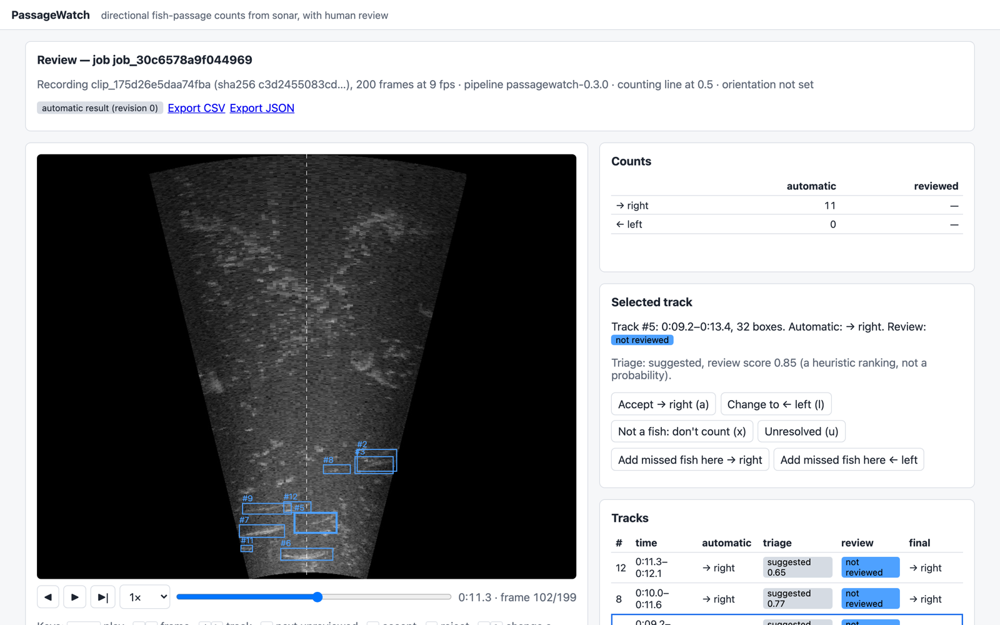
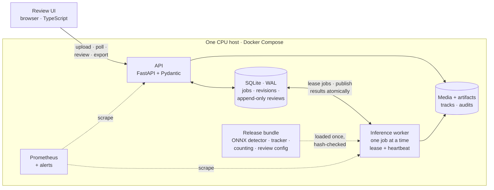
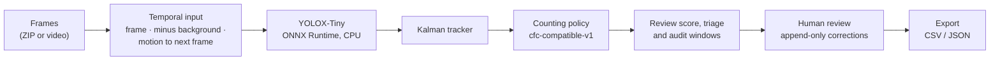

<div align="center">

# 🐟 PassageWatch

**Directional fish-passage counts from sonar video, with the evidence to check them.**

[](https://github.com/professor3333/passagewatch/actions/workflows/ci.yml)
[](https://github.com/professor3333/passagewatch/releases)
[](LICENSE)


[Quick start](#-quick-start) · [How it works](#-how-it-works) · [Results](#-results) ·
[Limitations](#-limitations) · [Documentation](#-documentation)



<sub>A kenai-holdout-v1 recording (CFC dataset) analysed by release <code>passagewatch-0.3.0</code>: 11 fish counted moving right, as in the reference annotation.</sub>

</div>

---

Fisheries technicians count salmon passing a sonar camera by watching hours of grainy
video. **PassageWatch** turns an uploaded recording into **suggested passage counts per
direction** (left/right, or upstream/downstream once the camera's orientation is set). Each
count comes with replayable evidence: every fish's track over the video, a review queue
that puts the uncertain tracks first, and random audits of footage the model did not flag.
The technician accepts or corrects the suggestions and exports a report that keeps the
automatic and reviewed counts apart and names the exact model and pipeline that produced
them.

It is a complete, measured workflow (data → detection → tracking → counting → human review →
export → monitoring), built and evaluated on the public
[Caltech Fish Counting dataset](https://data.caltech.edu/records/g945x-41103).

## ✨ At a glance

| | |
|---|---|
| 🎯 **Counting error on unseen rivers** | macro nMAE **0.213** [0.189, 0.238] over the 4 official CFC test locations, against **0.388** for a tuned classical baseline ([test results](docs/test_results.md)) |
| 🧪 **Counting error on unseen days** | nMAE **0.117** [0.089, 0.149] on 174 held-out Kenai clips ([error analysis](docs/error_analysis.md)) |
| ⚡ **CPU serving** | about **10 frames/s** on an Apple M1 (4 threads), roughly real time for 8–10 fps sonar. Peak memory **≈1.35 GB**, flat up to the 6,000-frame upload limit ([operations](docs/operations.md)) |
| 🔁 **Reproducible releases** | an immutable manifest per release (code commit, data manifest, checkpoint, ONNX and image hashes). Deployment is verified against it, and rollback is tested |
| 🧑‍🔬 **Usability study** | 4 independent participants. Assisted review **did not save time** on short clips, and the review panel's direction button made counts worse. The panel has since been changed, without a new measurement ([results](docs/usability_results.md)) |

Numbers in brackets are 95% paired-bootstrap intervals over clips. All are measured, on the
hardware and data named in the linked pages.

## 🧭 How it works



Each recording goes through the same steps, in this order:



**Counting.** Counts come only from completed tracks, never from summing detections. The
versioned policy `cfc-compatible-v1` reproduces the CFC benchmark's rule. A track counts by
the side of the counting line where it **starts** and the side where it **ends**, so a fish
that crosses and comes back contributes **zero**, and nearly stationary tracks are not
counted. The primary output is the image direction (→ right, ← left). It is mapped to
**upstream/downstream** only when the job sets `upstream_direction`, and that setting and
the line position (`line_x_normalized`) are recorded in every job and every export. Our
evaluator matches CFC's official one exactly on all 2,170 published baseline results
([counting policy](docs/counting_policy.md)).

## 🧰 Features

What exists today, not a roadmap:

- **Asynchronous analysis.** `POST /v1/jobs` returns `202` at once. A separate worker leases
  jobs with heartbeats, recovers abandoned ones, and retries within a deadline. Retries never
  duplicate results (tested by killing the worker mid-job).
- **Result cache and idempotency.** The cache is keyed on the recording's SHA-256 and
  metadata plus the full pipeline hash. Job creation takes an `Idempotency-Key`.
- **Review interface.** Play the recording with tracked boxes and the counting line, follow
  a review queue ordered by a heuristic **review score** (shown as a score, never as a
  probability), and use the triage states `suggested` / `needs_review` / `unresolved`. You
  can accept, reject, change a direction, mark a track unresolved, or add a fish the model
  missed.
- **Random audits** of footage the model did not flag, the only way to find fish the
  detector missed entirely.
- **Immutable history.** The original predictions never change. Every correction is an
  append-only event that creates a new result revision, and a stale `base_revision` gets
  `409 Conflict`.
- **Traceable exports** (CSV/JSON): recording ID, line and orientation, automatic and
  reviewed counts, unresolved cases, model and pipeline versions, and evidence timestamps.
- **Operations.** Structured JSON logs, Prometheus metrics and alerts, health and readiness
  checks, upload retention, bounded queues, and a read-only, non-root container with no
  extra privileges.
- **Release discipline.** Hash-checked bundles downloaded from GitHub releases, release
  manifests, deployment verification, and a tested rollback.
- **Demo examples.** Three CFC recordings (clear, difficult, unfamiliar camera) shown as
  visibly **cached** results, next to their reference counts. Opening one gives you a
  personal copy to review ([demos](docs/demos.md)).

## 🚀 Quick start

Requires Docker, and [uv](https://docs.astral.sh/uv/) for the helper scripts. Model weights
are not in git: each release's bundle (configuration, trained detector and its ONNX export,
38 MB) is attached to its [GitHub release](https://github.com/professor3333/passagewatch/releases).

```bash
git clone https://github.com/professor3333/passagewatch.git && cd passagewatch
uv run python scripts/fetch_bundle.py --release passagewatch-0.3.1 --activate   # verified against the release manifest
docker compose up -d --build
curl http://127.0.0.1:8000/health/ready
```

Optionally load the three demo examples (a 187 MB download from the `demos-v1` release,
analysed once by the running release):

```bash
uv run python scripts/load_demos.py --url http://127.0.0.1:8000
```

Then open **http://127.0.0.1:8000/**:

1. Upload a recording, with its frame rate, the sonar window in meters, the upstream
   direction and the counting line.
2. Follow the analysis, then play the recording with tracked fish and the counting line
   drawn on it.
3. Accept, reject, correct or mark each track unresolved, or add fish the model missed.
   A track the model did not count is counted only with an explicit **Count as passage**
   button. Keyboard shortcuts are listed under the player.
4. Compare automatic and reviewed counts, and export the report as CSV or JSON.

<details>
<summary><b>The same steps through the API</b></summary>

For a recording that is a ZIP of frames `0.jpg … N-1.jpg`, or a video:

```bash
curl -F file=@clip.zip -F framerate=10 -F x_meter_start=-1.6 -F x_meter_stop=1.6 \
     -F y_meter_start=4.4 -F y_meter_stop=0.5 http://127.0.0.1:8000/v1/clips
curl -X POST http://127.0.0.1:8000/v1/jobs -H 'Content-Type: application/json' \
     -d '{"clip_id": "<clip_id>", "counting": {"upstream_direction": "right"}}'
curl http://127.0.0.1:8000/v1/jobs/<job_id>/results
```

Other endpoints: `/v1/jobs/{id}/tracks` (paginated, `order=queue`), `/reviews`, `/audit`,
`/export`, `/v1/model-info`, `/health/live`, `/metrics`. See the
[architecture guide](docs/architecture.md).

</details>

If port 8000 is taken, set another with `PASSAGEWATCH_HTTP_PORT=8010 docker compose up -d`.
`./scripts/compose_smoke_test.sh` checks a deployment end to end with a random-weights
bundle (CI runs it).

## 📊 Results

Release `passagewatch-0.3.1` runs the same pipeline as `passagewatch-0.3.0`: only the
version name differs, and its release manifest records the same checkpoint, ONNX export and
evaluations. The results below were measured as 0.3.0 and apply to both.

### Official test locations

This is a one-time evaluation of the frozen release on 1,021 clips with 5,296 passages, at
four locations never used for training or tuning
([details](docs/test_results.md)). Directional nMAE = Σ(|R̂−R| + |L̂−L|) / Σ(R+L); lower is
better.

| System | elwha | kenai-channel | kenai-rightbank | nushagak | **Macro average** |
|---|---:|---:|---:|---:|---|
| Classical baseline `classical-v2` | 0.419 | 0.506 | 0.241 | 0.384 | 0.388 [0.351, 0.428] |
| YOLOX-Tiny, single frame (0.2.0) | 1.183 | 5.226 | 1.115 | 0.499 | 2.006 [1.708, 2.350] |
| **YOLOX-Tiny, temporal input (0.3.0)** | **0.168** | **0.256** | **0.075** | **0.355** | **0.213** [0.189, 0.238] |
| CFC published Baseline / Baseline++ (same clips) | 0.323 / 0.213 | 0.530 / 0.122 | 0.118 / 0.037 | 0.140 / 0.088 | 0.278 / 0.115 |

- **The release beats the classical baseline at every location** (macro difference −0.174
  [−0.215, −0.137]).
- **Temporal input made the difference.** Without it, the single-frame model counts static
  clutter on unfamiliar sonars as fish and fails to transfer.
- **Dense traffic (nushagak) is the main weakness.**
- **CFC's Baseline++ is still more accurate.** It uses a larger detector trained on three
  times as many recording days.

The test set has now been inspected, so it is a known benchmark. Stronger generalization
claims would need new data.

### Development data

Settings were selected on kenai-val (one day, 64 clips) and confirmed once on
`kenai-holdout-v1` (five other days, 174 clips, never used for training or selection):

| System | kenai-val nMAE | kenai-holdout-v1 nMAE |
|---|---|---|
| Classical baseline `classical-v2` (tuned on kenai-train) | 0.235 [0.181, 0.300] | 0.369 [0.316, 0.430] |
| YOLOX-Tiny, single frame (`passagewatch-0.2.0`) | 0.120 [0.078, 0.171] | 0.210 [0.166, 0.261] |
| **YOLOX-Tiny with temporal input (`passagewatch-0.3.0`)** | **0.066** [0.027, 0.111] | **0.117** [0.089, 0.149] |
| CFC published Baseline / Baseline++ | 0.049 / 0.033 | — |

The temporal input is the frame, the frame minus the recording's background, and the motion
to the next frame, after CFC's Baseline++. It cuts the holdout error by 44% against the
single-frame model: −0.093 [−0.133, −0.057]. Of six one-factor experiments, it is the only
one that showed a measured benefit, so it is the only one kept. The others were ByteTrack,
duplicate suppression, two tracker gates and a higher input resolution
([experiments](docs/error_analysis.md)).

### Runtime

Measured on the development Mac (Apple M1, 8 GB, CPU only, 4 threads)
([operations](docs/operations.md)):

| | |
|---|---|
| Release 0.3.0, PyTorch CPU, 541-frame clip | 98.5 ms/frame. The detector's forward pass is about 97% of the time |
| ONNX Runtime vs PyTorch, worker path (0.2.0 detector) | 89–98 vs 106–109 ms/frame, with identical counts and trajectories |
| Peak memory, 541 vs 6,000 frames (0.2.0) | 1.35 GB vs 1.36 GB |
| ONNX vs PyTorch counts, release 0.3.0, kenai-val | identical on 64 of 64 clips. On the test locations, identical on a 20-clip parity sample |

## 📦 Data

All data comes from the **Caltech Fish Counting (CFC)** dataset by Kay et al., published on
CaltechDATA: [record `g945x-41103`](https://data.caltech.edu/records/g945x-41103) (v1.1) and
[record `1y23m-j8r69`](https://data.caltech.edu/records/1y23m-j8r69) (tiny subset, MOT
labels and metadata), under the **MIT license**. Attribution and notices are in
[THIRD_PARTY_NOTICES.md](THIRD_PARTY_NOTICES.md) and the
[dataset card](docs/dataset_card.md). Data is downloaded from the publisher and never
committed.

```bash
make data-tiny       # ~1.5 GB: tiny subset, MOT annotations, clip metadata, baseline results
make validate-tiny   # check annotations, metadata, and every frame; write the report
make manifest-tiny   # validate, then write the versioned split manifest (tiny-v1)
make data-kenai-dev  # stream 44 GB once, keep ~19 GB of Kenai train/val frames (full-v2)
uv run python scripts/view_clip.py --location kenai-train --list    # list clips
uv run python scripts/view_clip.py --location kenai-train --sheet   # boxes on frames, as PNG
```

- **Checksums.** Every publisher file is listed with its size and MD5 in
  [`configs/data/cfc_sources.yaml`](configs/data/cfc_sources.yaml). Downloads resume after
  interruption, a file is kept only when its checksum matches, and every extracted file's
  SHA-256 is recorded in `data/manifests/inventory/`.
- **Validation.** The 1-based MOT annotations are converted to the internal convention
  **once**, then checked against the clip metadata and the frames. A clip with any error is
  **quarantined** with its reasons, never silently skipped.
- **Splits.** Each clip's partition is recorded in an immutable, versioned Parquet manifest
  (`data/manifests/splits/cfc/<version>.parquet`). It keeps the publisher's split by
  location and whole sequences only. Test-location clips are marked as never usable for
  tuning, and so are the tiny bundle's clips from test locations. The schema is in the
  [dataset card](docs/dataset_card.md#splits-and-manifests).

## 🗂️ Project structure

```text
src/passagewatch/
├── ingestion/        download, verify, extract, MOT → internal conversion, splits, manifests
├── validation/       annotation, metadata and frame checks; alignment
├── preprocessing/    letterbox and temporal channels (shared by training and serving)
├── detection/        classical detector, YOLOX (vendored, pinned), ONNX export and runtime
├── tracking/         Kalman tracker, ByteTrack (experiment)
├── counting/         cfc-compatible-v1 policy, direction mapping
├── calibration/      review score, triage, audit windows
├── training/         dataset, trainer (resumable, seeded)
├── evaluation/       nMAE, paired bootstrap, error attribution, ablations, study analysis
├── inference/        batch and service inference paths
├── monitoring/       stage timing
└── service/          API, worker, jobs, reviews, export, bundles, releases, metrics
frontend/             review UI (TypeScript, Vite, Vitest)
configs/              data, tracking and training configs (YAML, validated)
scripts/              thin CLIs: data, training, evaluation, bundles, releases, study
tests/                unit · data · integration · regression
releases/             immutable release manifests and evaluation reports
docs/                 design, cards, results, operations, architecture
```

| Layer | Tools |
|---|---|
| Modeling | PyTorch, YOLOX (Apache-2.0, vendored at a pinned commit), OpenCV, NumPy, MLflow (experiment tracking) |
| Data | Parquet manifests, SHA-256 inventories, CaltechDATA downloads |
| Serving | FastAPI, Pydantic, SQLite (WAL), ONNX Runtime (CPU) |
| Frontend | TypeScript, Vite, Vitest (no framework) |
| Operations | Docker Compose, Prometheus, structured JSON logs, GitHub Actions, GHCR |
| Tooling | uv, ruff, mypy (strict), pytest |

## 🛠️ Development

```bash
make install    # create the virtual environment and install dependencies (uv)
make check      # ruff, mypy, and the fast tests (no network or dataset needed)
npm --prefix frontend ci && npm --prefix frontend test   # frontend unit tests
make mlflow-import && make mlflow-ui   # training runs and evaluations in MLflow
```

- **Test priorities.** The tests cover what could silently change a count: the coordinate
  conversion round trip, direction mapping, the counting-policy fixtures (cross and return,
  gaps, splits near the line), train/serve preprocessing parity, API contracts
  (idempotency, `409` on a stale revision), and recovery after the worker is killed.
- **CI.** Every push runs lint, type checks, the tests, the frontend build, the Prometheus
  rules, `docker compose build` and a smoke test of the composed service. CI never touches
  the full dataset or the test split.
- **Development loop.** `docker compose up -d --build` after a change, then
  `./scripts/compose_smoke_test.sh`.

<details>
<summary><b>Reproducing the baselines and the release</b></summary>

The evaluator, checked against CFC's published tracks:

```bash
uv run python scripts/evaluate_counts.py --tracker baseline++   # kenai-val only by default
```

The classical baseline on kenai-val:

```bash
uv run python scripts/run_classical.py --manifest full-v2 --partitions val \
    --frames-dir data/extracted/cfc/kenai-dev-v1 --config configs/tracking/classical-v2.yaml
```

Training runs on a free Kaggle GPU ([training guide](docs/training.md)). To build the
release bundle yourself from the trained checkpoint (`models/runs/yolox-tiny-t1/epoch-025.pt`):

```bash
uv run python scripts/export_onnx.py --checkpoint models/runs/yolox-tiny-t1/epoch-025.pt \
    --out models/onnx/yolox-tiny-t1-epoch-025.onnx \
    --frames data/extracted/cfc/kenai-dev-v1/kenai-val/2018-06-03-JD154_LeftNear_Stratum1_Set1_LN_2018-06-03_210000_2467_3008
uv run python scripts/build_bundle.py --version passagewatch-0.3.1 \
    --checkpoint models/runs/yolox-tiny-t1/epoch-025.pt --score-threshold 0.4 \
    --tracking-config configs/tracking/classical-v2.yaml --selection docs/error_analysis.md \
    --calibration-version review-v0 --onnx models/onnx/yolox-tiny-t1-epoch-025.onnx --activate
```

</details>

## 🚢 Deployment and rollback

A release is an immutable manifest in [`releases/manifests/`](releases/manifests). It
records the code commit, lock hash, dataset manifest, training config, checkpoint and ONNX
hashes, preprocessing version, tracker config, counting-policy and calibration versions,
evaluation report, and container image digest. Tagging `passagewatch-*` runs the release
workflow, which checks the manifest, runs the tests, pushes the image to GHCR and publishes
the GitHub release.

- **Verify a deployment.** `/v1/model-info` must match the manifest, and an example job
  must complete (`scripts/verify_deployment.py`).
- **Roll back.** Point `bundles/active` at the previous bundle and restart with the matching
  image:
  - `scripts/fetch_bundle.py --release passagewatch-0.3.0 --activate`, the previous release
  - or `ln -sfn passagewatch-0.3.0 bundles/active` when it is already downloaded

  Existing jobs keep the versions recorded for them. The A → B → A rollback is an
  integration test.

Details are in [operations](docs/operations.md) and [architecture](docs/architecture.md).

**What is committed:** code, configs, tests, docs, split manifests and validation reports,
release manifests and evaluation reports, the usability study's records.
**What is not:** dataset files and frames, model weights and ONNX exports (they are on the
GitHub releases), runs, caches and service data.

## 🚧 Limitations

- **Selected clips.** CFC's clips were selected around fish activity, so the **false-alarm
  rate on continuous, mostly empty footage is not established**.
- **Narrow coverage.** 7 cameras across 3 rivers. Unfamiliar cameras and sonar settings,
  dense traffic, small or faint fish, and fragmentation near the line remain the main
  failure modes ([model card](docs/model_card.md)).
- **No species identification.** The output is fish vs. not-fish only.
- **Counts are suggestions.** They are meant to be reviewed before use. The review score is
  a heuristic ranking, not a calibrated probability, and no count confidence interval is
  shown in the product.
- **Counts can differ slightly between CPU architectures.** OpenCV's resize rounds a few
  input pixels differently on Apple arm64 than on x86, which changed 4 of 36 kenai-channel
  clips' counts. The deployed x86 image reproduces the x86 test evaluation. The development
  results were measured on the Mac
  ([details](docs/demos.md#results-depend-slightly-on-the-host)).
- **No time-saved claim.** The usability study (4 independent participants, short clips) did
  not show a time saving ([results](docs/usability_results.md)).

## 📚 Documentation

| Document | Contents |
|---|---|
| [Scope](docs/scope.md) | What Version 1 accepts, produces, and deliberately excludes |
| [Counting policy](docs/counting_policy.md) | Coordinate convention, the `cfc-compatible-v1` rule, direction mapping, the metric |
| [Dataset card](docs/dataset_card.md) | CFC source, verified format facts, validation, splits, manifests |
| [Classical baseline](docs/classical_baseline.md) | Method, tuning protocol, and results of the non-learned baseline |
| [Training](docs/training.md) | Training detectors on a free Kaggle GPU, resuming, collecting results |
| [Neural baseline](docs/neural_baseline.md) | YOLOX-Tiny through the same tracker; the ByteTrack experiment |
| [Error analysis](docs/error_analysis.md) | Why counts are wrong, and the one-factor experiments |
| [Review](docs/review.md) | Review scores, triage, random audits, and how prioritization is measured |
| [Test results](docs/test_results.md) | The release's one-time evaluation on the official test locations |
| [Demo examples](docs/demos.md) | The three cached demo recordings: how they were chosen, loaded and labelled |
| [Usability study](docs/usability_results.md) | Manual counting vs. assisted review: [design](docs/usability_study.md) and results |
| [Model card](docs/model_card.md) | Intended use, provenance, training data, metrics, failure modes, release process |
| [Operations](docs/operations.md) | Performance profile, reliability, hardening, releases, monitoring |
| [Architecture](docs/architecture.md) | API, worker, job lifecycle, storage, release bundles, configuration |
| [Roadmap](docs/roadmap.md) | Twelve stages, each with its completion test |
| [Independent check](docs/independent_check.md) | How someone who did not build it checks the documentation and reports back |
| [Design](docs/design.md) | The full system design |

**Status: Stage 12 of 12** ([roadmap](docs/roadmap.md)). The pipeline, review service and
release are complete and evaluated, and the usability study and the demo examples are done.
The remaining work is an [independent check](docs/independent_check.md) of the documentation.

## 🙏 Acknowledgements and license

- **Dataset.** Caltech Fish Counting dataset (Kay et al., ECCV 2022), MIT license.
- **Temporal input.** Inspired by the CFC authors' Baseline++. The differences are in the
  [model card](docs/model_card.md).
- **Detector.** YOLOX (Megvii, Apache-2.0), vendored at a pinned commit.

PassageWatch is released under the MIT license; see [LICENSE](LICENSE) and
[THIRD_PARTY_NOTICES.md](THIRD_PARTY_NOTICES.md).
