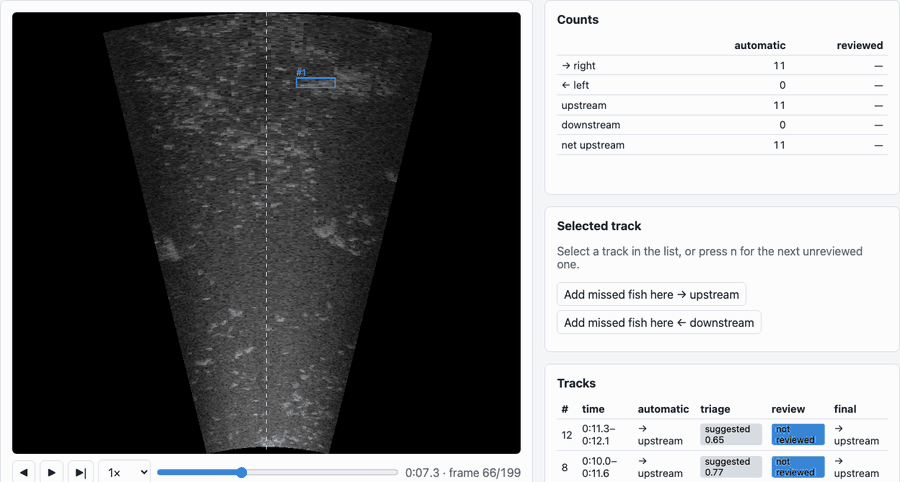
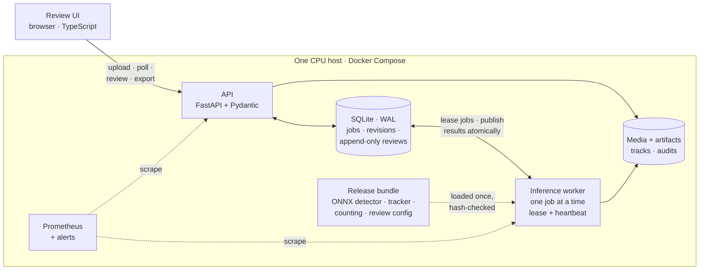

<div align="center">

# 🐟 PassageWatch

**Directional fish-passage counts from sonar video, with the evidence to check them.**

[](https://github.com/professor3333/passagewatch/actions/workflows/ci.yml)
[](https://github.com/professor3333/passagewatch/releases)
[](LICENSE)


[Quick start](#-quick-start) · [How it works](#-how-it-works) · [Results](#-results) ·
[Limitations](#-limitations) · [Documentation](#-documentation)

</div>

---

Fisheries technicians count salmon passing a sonar camera by watching hours of video.
**PassageWatch** turns a recording into **suggested passage counts per direction**, each
backed by the fish's track over the video. A review queue puts uncertain tracks first, and
random audits cover footage the model did not flag. The technician corrects the suggestions
and exports a report that keeps automatic and reviewed counts apart and names the exact
pipeline behind them. It is built and evaluated end to end on the public
[Caltech Fish Counting dataset](https://data.caltech.edu/records/g945x-41103).

<div align="center">



<sub>A <code>kenai-holdout-v1</code> recording (CFC) analysed by <code>passagewatch-0.3.3</code>:
fish tracked across the counting line, then one track accepted. 11 counted moving right,
as in the reference annotation.</sub>

</div>

## 📌 What to know first

| | |
|---|---|
| **For** | Technicians who count fish passing a sonar camera. PassageWatch suggests; the technician checks and corrects before the counts are used. |
| **How a fish is counted** | By the side of the counting line where its track **starts** and where it **ends**. Starts left, ends right: one passage → right. Crosses and comes back: **zero**, not two. Never crosses: zero. |
| **Accuracy** | On four locations never used for training or setting selection, count errors add up to about **21 per 100 true passages** (nMAE 0.213), against 39 for a tuned classical baseline and 28 / 12 for the dataset authors' Baseline / Baseline++ ([results](#-results)). |
| **Speed** | About **10 frames/s** on an Apple M1 CPU (roughly real time for sonar), peak memory ≈1.35 GB. |
| **Human review** | Measured, and not yet a win: reviewers saved no time on short clips and counted pieces of already-counted fish, making reviewed counts *less* accurate ([limitations](#-limitations)). |
| **Not for** | Species identification, unreviewed final figures, recognising a fish across recordings, or false-alarm rates on long empty footage. |

## 🧭 How it works


```mermaid
flowchart LR
    UI["Review UI<br/>browser · TypeScript"]
    subgraph host["One CPU host · Docker Compose"]
        direction LR
        API["API<br/>FastAPI + Pydantic"]
        DB[("SQLite · WAL<br/>jobs · revisions ·<br/>append-only reviews")]
        W["Inference worker<br/>one job at a time<br/>lease + heartbeat"]
        FS[("Media + artifacts<br/>tracks · audits")]
        B["Release bundle<br/>ONNX detector · tracker ·<br/>counting · review config"]
        P["Prometheus<br/>+ alerts"]
    end
    UI -- "upload · poll ·<br/>review · export" --> API
    API <--> DB
    API --> FS
    DB <-- "lease jobs · publish<br/>results atomically" --> W
    W --> FS
    B -. "loaded once,<br/>hash-checked" .-> W
    P -. scrape .-> API
    P -. scrape .-> W
```

**Pipeline:** frames (ZIP or video) → temporal input (frame, minus background, motion to the
next frame) → YOLOX-Tiny on ONNX Runtime (CPU) → Kalman tracker → counting policy → review
score, triage and audit windows → human review → CSV/JSON export.

**Counting.** Counts come only from completed tracks, never from summing detections. The
versioned policy `cfc-compatible-v1` uses the CFC benchmark's start/end-side rule, so a
fish that crosses and returns contributes zero, and nearly stationary tracks are skipped.
The primary output is the image direction (→ right, ← left); it maps to
upstream/downstream only when the job sets `upstream_direction`, and that setting and the
line position are stored in every job and export. Our evaluator matches CFC's official one
on all 2,170 published baseline results ([counting policy](docs/counting_policy.md)).

## 🧰 Features

- **Asynchronous jobs.** `POST /v1/jobs` returns `202`; a separate worker leases jobs with
  heartbeats, recovers abandoned ones and retries without duplicating results. Jobs are
  idempotent and cached by recording SHA-256 plus pipeline hash.
- **Review interface.** Playback with tracks and the counting line, a queue ordered by a
  heuristic **review score** (never shown as a probability), triage states, accept / reject
  / redirect / unresolved / add-missed-fish, and a "different fish?" check before counting a
  track next to an already-counted one.
- **Random audits** of unflagged footage, the only way to find fish the detector missed.
- **Immutable history.** Predictions never change; each correction is an append-only event
  creating a new revision, and a stale `base_revision` gets `409 Conflict`.
- **Traceable exports** with recording ID, line and orientation, automatic and reviewed
  counts, unresolved cases, pipeline versions and evidence timestamps.
- **Operations.** JSON logs, Prometheus metrics and alerts, health checks, upload
  retention, bounded queues, a read-only non-root container, hash-checked release bundles
  and tested rollback.
- **Demo examples.** Three CFC recordings, visibly labelled as **cached** results, next to
  their reference counts ([demos](docs/demos.md)).

## 🚀 Quick start

Requires Docker and [uv](https://docs.astral.sh/uv/). Model weights are not in git: each
release's 38 MB bundle is attached to its
[GitHub release](https://github.com/professor3333/passagewatch/releases).

> [!IMPORTANT]
> **Port 8000 must be free.** If another program holds it, Docker Desktop may start without
> an error while requests reach that program (`curl` won't show `passagewatch-0.3.3`).
> Check with `lsof -nP -iTCP:8000 -sTCP:LISTEN`; if taken, start with
> `PASSAGEWATCH_HTTP_PORT=8010 docker compose up -d --build` and use port 8010 everywhere.

```bash
git clone https://github.com/professor3333/passagewatch.git && cd passagewatch
uv run python scripts/fetch_bundle.py --release passagewatch-0.3.3 --activate   # verified against the release manifest
docker compose up -d --build                        # first build ≈9 min, ~2 GB image
curl http://127.0.0.1:8000/v1/model-info            # must start with {"pipeline_version":"passagewatch-0.3.3"
uv run python scripts/load_demos.py --url http://127.0.0.1:8000   # optional: 187 MB, ≈7 min
```

Open **http://127.0.0.1:8000/**, then either open a demo from the home page or upload a
recording (frame rate, sonar window in meters, upstream direction, counting line). Play it,
accept or correct each track (keyboard shortcuts are under the player), and export the
reviewed counts as CSV or JSON.

<details>
<summary><b>The same steps through the API</b></summary>

For a ZIP of frames `0.jpg … N-1.jpg`, or a video:

```bash
curl -F file=@clip.zip -F framerate=10 -F x_meter_start=-1.6 -F x_meter_stop=1.6 \
     -F y_meter_start=4.4 -F y_meter_stop=0.5 http://127.0.0.1:8000/v1/clips
curl -X POST http://127.0.0.1:8000/v1/jobs -H 'Content-Type: application/json' \
     -d '{"clip_id": "<clip_id>", "counting": {"upstream_direction": "right"}}'
curl http://127.0.0.1:8000/v1/jobs/<job_id>/results
```

Also: `/v1/jobs/{id}/tracks` (paginated, `order=queue`), `/reviews`, `/audit`, `/export`,
`/health/live`, `/metrics` ([architecture guide](docs/architecture.md)).
`scripts/verify_deployment.py --url …` checks the running service against its release
manifest.

</details>

## 📊 Results

Measured on release `passagewatch-0.3.0`; 0.3.1–0.3.3 run the identical pipeline (same
checkpoint, ONNX export and evaluations in their manifests). Directional
nMAE = Σ(|R̂−R| + |L̂−L|) / Σ(R+L), lower is better; brackets are 95% paired-bootstrap
intervals over clips.

**Official CFC test locations**: a one-time evaluation of the frozen release on 1,021 clips
and 5,296 passages at locations never used for training or setting selection
([details](docs/test_results.md)).

| System | elwha | kenai-channel | kenai-rightbank | nushagak | **Macro average** |
|---|---:|---:|---:|---:|---|
| Classical baseline `classical-v2` | 0.419 | 0.506 | 0.241 | 0.384 | 0.388 [0.351, 0.428] |
| YOLOX-Tiny, single frame (0.2.0) | 1.183 | 5.226 | 1.115 | 0.499 | 2.006 [1.708, 2.350] |
| **YOLOX-Tiny, temporal input (0.3.0)** | **0.168** | **0.256** | **0.075** | **0.355** | **0.213** [0.189, 0.238] |
| CFC published Baseline / Baseline++ | 0.323 / 0.213 | 0.530 / 0.122 | 0.118 / 0.037 | 0.140 / 0.088 | 0.278 / 0.115 |

The release beats the classical baseline at every location (macro −0.174 [−0.215, −0.137]).
Temporal input is what makes it transfer; dense traffic (nushagak) is the main weakness, and
CFC's Baseline++ (a larger detector, three times the training days) is still more accurate.
The test set has now been inspected, so it is a known benchmark.

<details>
<summary><b>Development data and runtime</b></summary>

Settings were selected on kenai-val (64 clips) and confirmed once on `kenai-holdout-v1`
(174 clips from five other days, never used for training or selection):

| System | kenai-val | kenai-holdout-v1 |
|---|---|---|
| Classical baseline `classical-v2` | 0.235 [0.181, 0.300] | 0.369 [0.316, 0.430] |
| YOLOX-Tiny, single frame (0.2.0) | 0.120 [0.078, 0.171] | 0.210 [0.166, 0.261] |
| **YOLOX-Tiny, temporal input (0.3.0)** | **0.066** [0.027, 0.111] | **0.117** [0.089, 0.149] |
| CFC published Baseline / Baseline++ | 0.049 / 0.033 | — |

Of six one-factor experiments, only the temporal input (after CFC's Baseline++) showed a
measured benefit (holdout −0.093 [−0.133, −0.057]); ByteTrack, duplicate suppression, two
tracker gates and higher resolution were not kept ([experiments](docs/error_analysis.md)).

Runtime on an Apple M1 (8 GB, CPU, 4 threads): 98.5 ms/frame for release 0.3.0 with the
detector at ~97% of the time; ONNX Runtime 89–98 vs PyTorch 106–109 ms/frame with identical
counts; peak memory 1.35 GB at 541 frames and 1.36 GB at 6,000
([operations](docs/operations.md)).

</details>

## 📦 Data

All data is from the **Caltech Fish Counting (CFC)** dataset (Kay et al.) on CaltechDATA,
[record `g945x-41103`](https://data.caltech.edu/records/g945x-41103) (v1.1) and
[record `1y23m-j8r69`](https://data.caltech.edu/records/1y23m-j8r69) (tiny subset, MOT
labels, metadata), under the **MIT license** ([notices](THIRD_PARTY_NOTICES.md)). It is
downloaded from the publisher and never committed. Downloads are resumable and
checksum-verified; the 1-based MOT annotations are converted once and validated, bad clips
are quarantined with a reason, and each clip's partition (publisher split, whole sequences
only, test locations never tunable) is recorded in an immutable Parquet manifest
([dataset card](docs/dataset_card.md#splits-and-manifests)).

```bash
make data-tiny && make manifest-tiny   # ~1.5 GB tiny subset → validated tiny-v1 manifest
make data-kenai-dev                    # stream 44 GB once, keep ~19 GB of Kenai train/val
uv run python scripts/view_clip.py --location kenai-train --sheet   # boxes on frames
```

## 🛠️ Development

```bash
make install    # virtual environment and dependencies (uv)
make check      # ruff, mypy, fast tests: no network or dataset needed
npm --prefix frontend ci && npm --prefix frontend test
docker compose up -d --build && ./scripts/compose_smoke_test.sh   # the Compose loop
```

Tests target what could silently change a count: coordinate conversion, direction mapping,
counting fixtures, train/serve preprocessing parity, API contracts and worker-kill
recovery. CI runs all of this plus the frontend build, Prometheus rules and a composed
smoke test, and never touches the full dataset or the test split.

<details>
<summary><b>Reproducing the baselines and the release</b></summary>

```bash
uv run python scripts/evaluate_counts.py --tracker baseline++   # our evaluator vs CFC's tracks (kenai-val)
uv run python scripts/run_classical.py --manifest full-v2 --partitions val \
    --frames-dir data/extracted/cfc/kenai-dev-v1 --config configs/tracking/classical-v2.yaml
```

Training runs on a free Kaggle GPU ([training guide](docs/training.md)). To build the
release bundle from the trained checkpoint:

```bash
uv run python scripts/export_onnx.py --checkpoint models/runs/yolox-tiny-t1/epoch-025.pt \
    --out models/onnx/yolox-tiny-t1-epoch-025.onnx \
    --frames data/extracted/cfc/kenai-dev-v1/kenai-val/2018-06-03-JD154_LeftNear_Stratum1_Set1_LN_2018-06-03_210000_2467_3008
uv run python scripts/build_bundle.py --version passagewatch-0.3.3 \
    --checkpoint models/runs/yolox-tiny-t1/epoch-025.pt --score-threshold 0.4 \
    --tracking-config configs/tracking/classical-v2.yaml --selection docs/error_analysis.md \
    --calibration-version review-v0 --onnx models/onnx/yolox-tiny-t1-epoch-025.onnx --activate
```

</details>

| Layer | Tools |
|---|---|
| Modeling | PyTorch, YOLOX (Apache-2.0, vendored at a pinned commit), OpenCV, NumPy, MLflow |
| Serving | FastAPI, Pydantic, SQLite (WAL), ONNX Runtime (CPU) |
| Frontend | TypeScript, Vite, Vitest |
| Operations | Docker Compose, Prometheus, JSON logs, GitHub Actions, GHCR |
| Tooling | uv, ruff, mypy (strict), pytest |

<details>
<summary><b>Project structure</b></summary>

```text
src/passagewatch/
├── ingestion/        download, verify, MOT → internal conversion, splits, manifests
├── validation/       annotation, metadata and frame checks
├── preprocessing/    letterbox and temporal channels (shared by training and serving)
├── detection/        classical detector, YOLOX (vendored), ONNX export and runtime
├── tracking/         Kalman tracker, ByteTrack (experiment)
├── counting/         cfc-compatible-v1 policy, direction mapping
├── calibration/      review score, triage, audit windows
├── training/         dataset, resumable seeded trainer
├── evaluation/       nMAE, paired bootstrap, error attribution, ablations, studies
├── inference/        batch and service inference
├── monitoring/       stage timing
└── service/          API, worker, jobs, reviews, export, bundles, releases, metrics
frontend/  configs/  scripts/  tests/  releases/  docs/
```

</details>

## 🚢 Deployment and rollback

Each release is an immutable manifest in [`releases/manifests/`](releases/manifests)
(code commit, lock, data manifest, checkpoint and ONNX hashes, preprocessing, tracker,
counting and calibration versions, evaluation report, image digest). Tagging
`passagewatch-*` checks the manifest, runs the tests, pushes the image to GHCR and
publishes the release. `scripts/verify_deployment.py` confirms a deployment matches it.

**Roll back** by restoring the previous bundle and its image:
`uv run python scripts/fetch_bundle.py --release passagewatch-0.3.2 --activate` (or
`ln -sfn passagewatch-0.3.2 bundles/active`), then restart. Existing jobs keep their
recorded versions; A → B → A rollback is an integration test
([operations](docs/operations.md)).

**Committed:** code, configs, tests, docs, split manifests, validation reports, release
manifests and evaluations, study records. **Not committed:** dataset files, weights and
ONNX exports (on GitHub releases), runs, caches, service data.

## 🚧 Limitations

- **Selected clips.** CFC clips were chosen around fish activity, so false alarms on long,
  mostly empty footage are **not established**.
- **Narrow coverage.** 7 cameras on 3 rivers; unfamiliar sonars, dense traffic, faint fish
  and fragmentation near the line are the main failure modes ([model card](docs/model_card.md)).
- **Fish vs. not-fish only.** No species identification.
- **Counts are suggestions.** The review score is a heuristic ranking, not a probability;
  no count confidence interval is shown in the product.
- **Review did not help yet.** A usability study (4 independent participants) showed no
  time saving ([results](docs/usability_results.md)), and in a 15-clip reviewed sample
  reviewers counted fragments of already-counted fish, so reviewed counts were further from
  the reference ([results](docs/review_sample_results.md)). The "different fish?" check
  added since then is untested on reviewers.
- **Host differences.** OpenCV resizes a few pixels differently on arm64 and x86, which
  changed 4 of 36 kenai-channel counts. Development numbers are from the Mac; the x86 image
  reproduces the x86 test evaluation ([details](docs/demos.md#results-depend-slightly-on-the-host)).

## 📚 Documentation

| Topic | Documents |
|---|---|
| Product | [Scope](docs/scope.md) · [Counting policy](docs/counting_policy.md) · [Review](docs/review.md) · [Demos](docs/demos.md) · [Model card](docs/model_card.md) |
| Data and training | [Dataset card](docs/dataset_card.md) · [Training](docs/training.md) · [Classical baseline](docs/classical_baseline.md) · [Neural baseline](docs/neural_baseline.md) |
| Evaluation | [Test results](docs/test_results.md) · [Error analysis](docs/error_analysis.md) · [Usability study](docs/usability_results.md) · [Reviewed sample](docs/review_sample_results.md) · [Same-fish re-test](docs/review_retest.md) |
| Engineering | [Architecture](docs/architecture.md) · [Operations](docs/operations.md) · [Design](docs/design.md) · [Roadmap](docs/roadmap.md) · [Independent check](docs/independent_check.md) |

**Status:** all 12 [roadmap](docs/roadmap.md) stages complete; a re-test of the review
page's same-fish check with new reviewers is declared and pending.

## 🙏 Acknowledgements and license

Dataset: Caltech Fish Counting (Kay et al., ECCV 2022), MIT. Temporal input inspired by
the CFC authors' Baseline++ (differences in the [model card](docs/model_card.md)).
Detector: YOLOX (Megvii, Apache-2.0), vendored at a pinned commit. PassageWatch is MIT
licensed: [LICENSE](LICENSE), [THIRD_PARTY_NOTICES.md](THIRD_PARTY_NOTICES.md).
