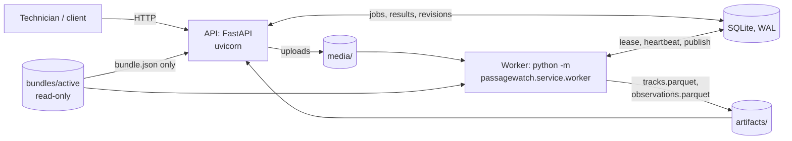
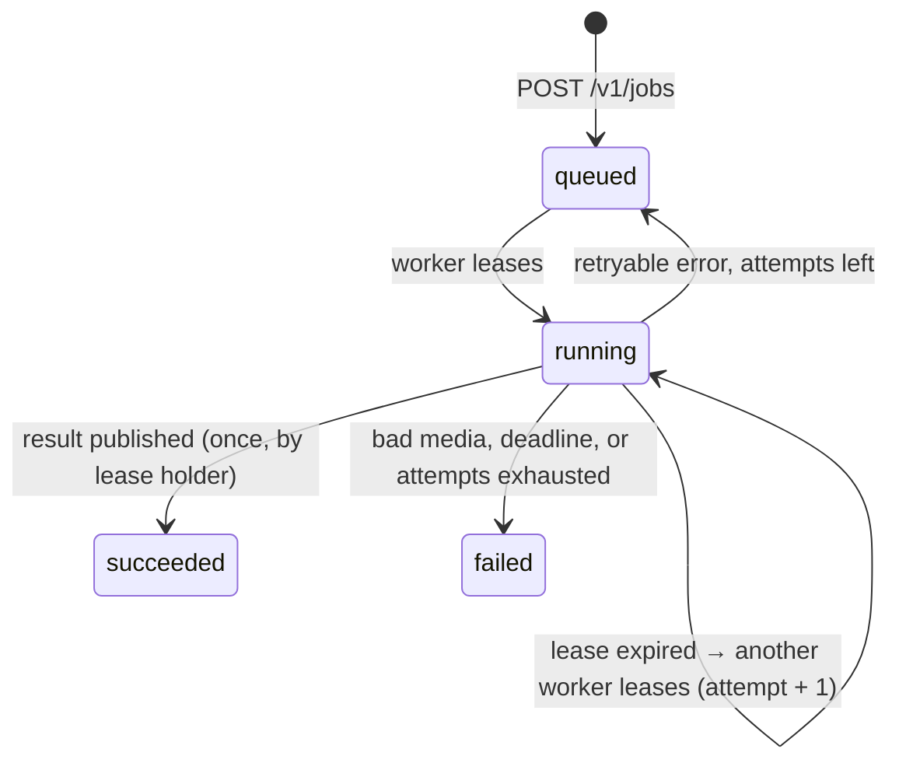

# Service Architecture

PassageWatch runs as two processes from one Docker image, sharing one data volume. The
API never runs inference: it records jobs and serves results. A separate worker leases jobs,
runs the release bundle's pipeline, and publishes results.

| Component | Code | Role |
|---|---|---|
| API | `passagewatch.service.api` | Uploads, job creation (202), status, results, tracks, model info, health |
| Worker | `passagewatch.service.worker` | Loads the bundle once; leases and runs one job at a time |
| Job store | `passagewatch.service.jobs` | Durable job lifecycle in SQLite: leases, retries, deadlines, publication |
| Catalog | `passagewatch.service.catalog` | Clips (with retention), pipeline versions, worker readiness |
| Media | `passagewatch.service.media` | Streamed uploads with a size limit, validation, bounded-memory frame reading |
| Bundles | `passagewatch.service.bundle` | Immutable release bundles and the active-release pointer |
| Artifacts | `passagewatch.service.artifacts` | Per-job Parquet files with trajectories and their boxes |

## Analysis flow

1. `POST /v1/clips` streams the recording to `media/<clip_id>/` while hashing it (SHA-256),
   validates it (a ZIP of frames `0..N-1` or a decodable video), and records it, with its
   frame rate and the sonar window in meters, and an expiry time.
2. `POST /v1/jobs` records a job against the **active pipeline version** and returns
   `202 Accepted` at once, with the status URL in `Location`. An `Idempotency-Key` makes the
   request safe to retry. An identical analysis (same recording, same pipeline
   configuration, same counting configuration) is answered from the result cache.
3. The worker leases the oldest queued job of **its own** pipeline version. It decodes
   frames in batches and keeps only their detections, then tracks sequentially, then counts
   completed trajectories with the job's counting line (`cfc-compatible-v1`).
4. The worker writes the artifacts, then publishes result revision 0 and marks the job
   succeeded, in one transaction.
5. `GET /v1/jobs/{id}`, `/results` and `/tracks` serve status, counts and trajectories.
   Results keep automatic and reviewed counts in separate fields.

## Review and export

Revision 0 of a result is the automatic one and never changes. A reviewer submits
corrections with `POST /v1/jobs/{id}/reviews`. Each correction names the revision it was
based on, is stored as an append-only `review_events` row, and produces a new
`result_revisions` row with the decisions so far and the reviewed counts. If the base
revision is not the latest, because another reviewer saved first, the correction is refused
with **409 Conflict**. Automatic and reviewed counts are always separate fields.

| Action | Effect on the reviewed counts |
|---|---|
| `accept` (track) | Counts with its automatic direction (confirmed) |
| `reject` (track or added passage) | Does not count (not a fish, a duplicate fragment, a mistaken addition) |
| `set_direction` (track) | Counts with the reviewer's direction |
| `mark_unresolved` (track) | Excluded from the counts and listed as unresolved |
| `add_passage` (direction, frame) | A fish the model missed; counts, with that frame as evidence |

`GET /v1/jobs/{id}/export?format=json|csv&revision=N` produces a report for any revision. It
contains:
- the recording ID and SHA-256;
- the counting policy, line and orientation;
- the automatic and reviewed counts (upstream/downstream when an orientation is set);
- the unresolved cases;
- the pipeline version, config hash and detector checkpoint hash;
- every track and added passage with its evidence frames and times, review state and final
  direction;
- the review history up to that revision.

The CSV has the metadata and counts as `# key,value` lines above one row per case.

For the review interface:
- `GET /v1/clips/{id}` returns the clip metadata;
- `GET /v1/clips/{id}/frames/{n}` returns a frame as an image;
- `GET /v1/jobs/{id}/observations?start=&stop=` returns every tracked box in a window of up
  to 500 frames, for overlays;
- `/tracks` also returns each track's review state and final direction.

## Job lifecycle

| Guarantee | How |
|---|---|
| No request waits for inference | Jobs are asynchronous; the API returns 202 |
| One worker per job | Leases are taken in `BEGIN IMMEDIATE` transactions (tested with racing connections) |
| Crashed workers do not lose jobs | An expired lease is leased again, up to `max_attempts`; tested with a SIGKILLed worker process |
| No duplicate results | Revision 0 and the success status are written together, only by the current lease holder |
| A stalled worker cannot publish late | Its heartbeat fails once the lease is taken over, and it stops at the next batch |
| No silent model switch | Workers lease only jobs of their own pipeline version; a mismatched bundle refuses to load |
| History is not rewritten | `result_revisions` and `review_events` are append-only (database triggers) |

## Storage

| Path (inside `/data`) | Contents |
|---|---|
| `service.db` | SQLite (WAL, schema v3): `clips`, `jobs`, `pipeline_versions`, `result_revisions` (with each revision's review decisions), `review_events`, `workers` |
| `media/<clip_id>/` | Uploaded recording; deleted after its retention period unless a job needs it |
| `artifacts/<job_id>/` | `tracks.parquet` (one row per trajectory), `observations.parquet` (every box) |

## Release bundles

A bundle (`bundles/<version>/`) holds `bundle.json` and the detector checkpoint. It is built
by `scripts/build_bundle.py` from a training checkpoint, and records:
- the checkpoint's SHA-256;
- the detector's size, input size, training run and epoch, and the score threshold;
- the preprocessing version;
- the tracker configuration;
- the counting policy;
- provenance: the training manifest hash and where the selection is documented.

Versions are immutable. `bundles/active` is a symlink to the active version. The API reads
only `bundle.json`, to register the pipeline version and answer `/v1/model-info`. The
worker loads the weights, after checking their SHA-256 and the preprocessing version.
Bundles are mounted read-only into the containers and never committed or built into the
image.

Current release (local, not committed): `passagewatch-0.2.0`. It is YOLOX-Tiny
`yolox-tiny-v1` epoch 25 (checkpoint SHA-256 `7c9bfedc…`), with score threshold 0.2 and the
`classical-v2` tracker, as selected in [neural_baseline.md](neural_baseline.md). A
regression test checks that the service counts a real kenai-val clip exactly as the offline
evaluation did.

## Configuration

All settings are `PASSAGEWATCH_*` environment variables (`passagewatch.service.settings`):

| Variable | Default | Meaning |
|---|---|---|
| `PASSAGEWATCH_DATA_DIR` | `var` (`/data` in the image) | Database, uploads, artifacts |
| `PASSAGEWATCH_BUNDLE_DIR` | `bundles/active` (`/bundles/active`) | Active release bundle |
| `PASSAGEWATCH_MAX_UPLOAD_BYTES` | 524288000 (500 MiB) | Upload size limit (413 above) |
| `PASSAGEWATCH_MAX_FRAMES` | 6000 | Frame limit per recording |
| `PASSAGEWATCH_UPLOAD_RETENTION_HOURS` | 24 | Uploads are deleted after this |
| `PASSAGEWATCH_MAX_QUEUE` | 20 | Queued + running jobs before 503 |
| `PASSAGEWATCH_MAX_ATTEMPTS` | 3 | Attempts per job |
| `PASSAGEWATCH_JOB_DEADLINE_SECONDS` | 3600 | A job running longer fails |
| `PASSAGEWATCH_LEASE_SECONDS` | 120 | Lease length; extended by heartbeats |
| `PASSAGEWATCH_HEARTBEAT_SECONDS` | 20 | Worker heartbeat interval |
| `PASSAGEWATCH_TRACKS_PAGE_LIMIT` | 200 | Maximum `limit` for `/tracks` |
| `PASSAGEWATCH_DEVICE` | `cpu` | Inference device (`auto` tries CUDA, then MPS) |
| `PASSAGEWATCH_INFERENCE_BATCH` | 8 | Frames per detector batch |
| `PASSAGEWATCH_WORKER_POLL_SECONDS` | 2 | Idle polling interval |
| `PASSAGEWATCH_RETENTION_SWEEP_SECONDS` | 600 | How often expired uploads are deleted |
| `PASSAGEWATCH_WORKER_STALE_SECONDS` | 60 | A worker silent this long no longer counts for readiness |

## Logs

Both processes write one JSON object per line to stdout (`passagewatch.service.logs`),
including Uvicorn's access log. Worker events carry `job_id`, `worker_id`, `attempt` and
result fields as top-level keys.

## Known limits

- **CPU inference is slow.** YOLOX-Tiny at 960 × 416 takes about 247 ms per frame on the
  development M1 CPU. Stage 10 profiles this and tries ONNX Runtime, a smaller input size
  and INT8. ONNX Runtime would also remove PyTorch from the image, which is now 1.98 GB,
  647 MB of it PyTorch.
- **One host, one worker.** SQLite and local volumes are deliberate for this scale (see
  [design](design.md) §17).
- **Not yet built:** the review interface (Stage 7), the reverse proxy with HTTPS,
  Prometheus metrics and alerts (Stage 11).
