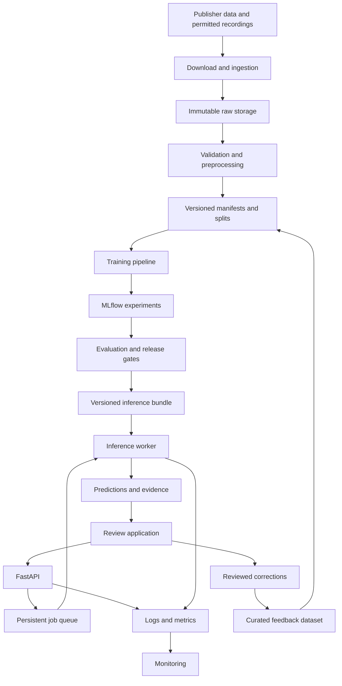

# PassageWatch — Design Document

Build PassageWatch: an auditable fish-passage counting and review system for sonar video.

A fisheries technician uploads a recording, receives directional fish counts with replayable evidence, reviews uncertain tracks, corrects mistakes, and exports a traceable report.

This project combines challenging visual learning with temporal reasoning, evaluation across unfamiliar cameras, asynchronous inference, human review, deployment, and monitoring. Its distinctive contribution is the complete, measurable workflow. You do not need to invent a new neural architecture.

The design below assumes one developer, access to an occasional GPU, and approximately 12–16 weeks at 10–15 hours per week. Compute estimates and performance targets are planning assumptions—not measured results.

> Section numbering is kept stable for cross-references; portfolio-planning sections (28, 30–32) are maintained separately. The staged delivery plan is in [roadmap.md](roadmap.md).

---

## 1. Project name

**PassageWatch — Auditable Fish-Passage Analytics**

One-sentence description: An end-to-end deep learning application that detects and tracks fish in sonar recordings, estimates directional passage counts, and helps technicians verify results through timestamped evidence and a prioritized review queue.

Suggested repository name: `passagewatch`.

## 2. Real-world problem

Fisheries monitoring programs need to estimate how many fish move through observation sites and in which direction. In murky water, sonar provides useful imagery where ordinary cameras struggle.

The operational work includes watching recordings, distinguishing fish from background returns, following trajectories, recording direction, and checking counts. For example, Alaska's Anchor River monitoring plan describes technicians reviewing sonar files, marking upstream, downstream, or neutral movement, and transferring summaries into a database.

Source: https://www.adfg.alaska.gov/FedAidPDFs/ROP.SF.2A.2024.01.pdf

## 3. Real users

| User | How they would use PassageWatch |
|---|---|
| Fisheries technician | Upload recordings, review flagged trajectories, correct counts, export results |
| Fisheries biologist | Compare passage summaries and inspect recordings with unusual counts |
| Conservation research team | Process historical footage using a reproducible pipeline |
| Monitoring-program supervisor | Audit corrections, compare reviewers, and trace reports to model versions |

The initial workflow is deliberately familiar:

Export recording → upload → review → download CSV → import into the team's existing analysis system.

You can demonstrate the product without obtaining a live institutional deployment. Any claim about actual time saved should come from a measured user study.

## 4. Why deep learning is justified

The difficult perceptual task is recognizing fish within noisy, changing sonar imagery.

A useful comparison is:

| Approach | Useful capability | Main limitation |
|---|---|---|
| Intensity thresholds | Find bright returns cheaply | Background structures and debris can also be bright |
| Background subtraction | Identify changing regions | Moving sediment produces candidates; stationary fish can disappear |
| Optical flow and connected components | Estimate motion and extract blobs | Motion alone does not establish that a target is a fish |
| Handcrafted features plus a classifier | Reject some non-fish candidates | Performance depends on the proposal generator and manually designed features |
| Learned visual detector | Learn spatial patterns across scales and conditions | Requires training data and careful evaluation under domain shift |

Deep learning supplies the learned visual representation. Tracking and counting can still use simpler algorithms.

This division is appropriate: use a neural network for difficult perception, then explicit, testable logic for trajectory association and counting.

The justification must also be empirical. Train a competitive classical vision baseline and measure whether the neural system reduces counting error under the same evaluation protocol. A neural network that produces nicer overlays without improving counts has not established its value.

## 5. Dataset and data collection

Use one primary dataset: the Caltech Fish Counting Dataset, or CFC.

| Attribute | Details |
|---|---|
| Original source | Caltech and collaborating researchers |
| Modality | Grayscale sonar video, distributed as ordered image sequences |
| Size | 1,567 sequences; approximately 527,000 frames |
| Annotations | Approximately 516,000 bounding boxes covering 8,254 fish tracks |
| Coverage | Seven sonar cameras across three rivers |
| Duration | Approximately 16.7 hours |
| Labels | Fish bounding boxes and identities across frames; counts derived using the benchmark's counting protocol |

These figures come from the CFC paper (ECCV 2022): https://www.ecva.net/papers/eccv_2022/papers_ECCV/papers/136680281.pdf

### Access and storage

Use https://data.caltech.edu/records/g945x-41103, which offers separate location downloads:

- Kenai training/validation imagery: approximately 44.1 GB.
- Individual test-location downloads: approximately 1.7–51 GB.
- All raw grayscale archives: approximately 131 GB.
- The older release also includes a 1.4 GB tiny dataset for initial development: https://data.caltech.edu/records/1y23m-j8r69

The version 1.1 record also contains preprocessed imagery. You do not need to download both raw and preprocessed copies.

### License

The publisher's machine-readable metadata lists the license as MIT and the files as publicly accessible. Preserve the publisher metadata, attribution, and accompanying notices in your data documentation.

Metadata: https://data.caltech.edu/api/records/g945x-41103

### Quality and limitations

The data contains realistic noise, occlusion, and substantial variation between deployments. Crucially, the clips were selected around known fish activity. Consequently, performance on CFC alone does not establish the false-alarm rate for hours of uninterrupted, mostly empty monitoring footage. (Source: https://www.ecva.net/papers/eccv_2022/papers_ECCV/papers/136680281.pdf)

Other limitations to document:

- Geographic and hardware coverage is limited.
- Annotation mistakes remain possible.
- Closely spaced frames are highly correlated.
- This project's label space supports fish detection, not reliable species identification.

### Additional data you can realistically create yourself

Create a small review-quality annotation set from existing public clips:

1. Select 50–100 clips from development data.
2. Mark missed fish, duplicate tracks, direction mistakes, and ambiguous cases.
3. Record whether each proposed count contribution is correct.
4. Re-annotate a subset later, or have a second reviewer inspect it.
5. Store disagreements rather than silently resolving every ambiguity.

This requires annotation effort, not new hardware.

For a later field pilot, obtain permission to use continuous recordings that include empty periods. Even a few hours would help investigate false alarms, although it would remain a small operational sample. Preserve recording context and obtain permission before redistributing partner footage.

## 6. What the finished system actually does

A technician:

1. Uploads a sonar clip or selects a bundled example.
2. Confirms the counting line and which image direction corresponds to upstream.
3. Starts an analysis job.
4. Receives directional counts, trajectories, and a review queue.
5. Opens uncertain cases directly at their timestamps.
6. Accepts, rejects, merges, or corrects proposed trajectories.
7. Exports an approved report.

The complete processing path is:

Recording → validation → frame decoding → preprocessing → neural detections → tracking → counting → review prioritization → human corrections → export.

Each exported report includes:

- Recording identifier.
- Counting configuration.
- Automatic counts.
- Reviewed counts.
- Remaining unresolved cases.
- Model and pipeline versions.
- Links or timestamps for supporting evidence.

## 7. Inputs → prediction → action

| Stage | Concrete definition |
|---|---|
| Inputs | Sonar video or ordered frames; frame timing; counting-line position; optional upstream orientation |
| Neural output | Fish bounding boxes and detection scores |
| Tracking output | Trajectories connecting detections over time |
| Counting output | Left/right passage contributions, mapped to upstream/downstream when orientation is known |
| Review output | Ranked cases with uncertainty or consistency flags |
| User action | Verify footage, correct errors, approve counts, export results |

Do not interpret the sum of detections across frames as a fish count.

Similarly, a track ID identifies a trajectory within an analyzed recording. It does not establish an individual fish's identity across separate recordings.

## 8. Deep learning problem type

The central task is object detection in sonar imagery, combined with:

- **Temporal representation:** incorporating evidence from neighboring frames or background changes.
- **Multiple-object tracking:** maintaining trajectories.
- **Directional counting:** converting trajectories into useful measurements.
- **Selective review:** identifying results that deserve human attention.

Detection is appropriate because the interface needs spatial evidence. Tracking is necessary because the same fish appears in many frames.

A direct count-regression model would produce a simpler output, but it would make individual mistakes harder to inspect and correct. The auditable workflow is a strong reason to retain trajectories.

## 9. Model strategy

Build three controlled levels.

| Level | Recommended implementation | Purpose |
|---|---|---|
| Classical baseline | Background subtraction → connected components → size/motion filtering → Kalman-based association | Establish the value of learned perception |
| Neural baseline | COCO-pretrained YOLOX-Tiny, grayscale repeated across three channels, plus the same tracker | Isolate the gain from deep learning |
| Strong candidate | YOLOX-S with temporal input channels, followed by ByteTrack | Investigate better detection and reduced fragmentation |

YOLOX provides compact anchor-free detectors and export support under Apache-2.0. Use the architecture that best meets your measured accuracy and deployment requirements. (https://github.com/Megvii-BaseDetection/YOLOX)

For the temporal input, investigate:

- Current intensity.
- Background-subtracted intensity.
- Frame-to-frame change.

This is informed by the CFC authors' Baseline++ approach; credit that work and identify your implementation differences. (https://www.ecva.net/papers/eccv_2022/papers_ECCV/papers/136680281.pdf)

ByteTrack is a useful candidate because it can associate lower-score detections with existing tracks, potentially recovering briefly obscured targets. Its improvement on sonar must be measured. (https://github.com/FoundationVision/ByteTrack)

### Required ablations

Change one factor at a time:

1. Classical proposals versus neural detections.
2. Single-frame versus temporal input, using the same detector size.
3. Simple tracker versus ByteTrack, using identical detections.
4. Tiny versus Small detector, using identical preprocessing.
5. Full precision versus the optimized deployment model.

This prevents attributing an improvement to the wrong component.

## 10. Pretraining versus training from scratch

Start with transfer learning from COCO-pretrained detector weights.

The domains differ, but pretrained spatial features provide a useful initialization worth testing.

Recommended sequence:

1. Replace the classification head with the fish label configuration.
2. Briefly train the new head.
3. Unfreeze the backbone.
4. Fine-tune the whole detector with a smaller backbone learning rate.
5. Compare against a short training-from-scratch control.

For temporal channels, their meanings differ from RGB. Treat first-layer initialization as an experiment: compare retaining pretrained weights with reinitializing the input layer.

Avoid a long frozen-backbone phase because sonar may require substantial feature adaptation.

LoRA is unnecessary for this compact CNN-based design. Self-supervised sonar pretraining belongs in an advanced extension, after the supervised system works.

## 11. Data pipeline

Use this sequence:

Download → verify → inventory → validate → assign splits → preprocess → augment during training → produce versioned training manifests.

Assign splits before creating derived samples.

| Step | Implementation |
|---|---|
| Ingestion | Resumable downloads from publisher URLs |
| Integrity | Check publisher checksums; compute your own SHA-256 inventory |
| Validation | Check image decoding, dimensions, frame ordering, box bounds, and annotation references |
| Label conversion | Convert source coordinates once into a documented internal convention |
| Duplicate checks | Detect repeated files and duplicated sequences; inspect cross-split near-duplicates |
| Preprocessing | Preserve aspect ratio, resize with padding, normalize consistently |
| Temporal features | Construct context within the same sequence only |
| Augmentation | Apply consistent geometry to frames and boxes |
| Versioning | Store manifests, split definitions, preprocessing configuration, and provenance |

The CFC MOT annotations use one-based indexing. A coordinate-conversion error can quietly damage both training and evaluation. (https://github.com/visipedia/caltech-fish-counting/tree/main/CFC)

### Leakage prevention

- Preserve the publisher's train/validation/test separation.
- Never randomly split individual frames.
- Keep derived frames and temporal neighbors in their parent sequence's partition.
- Use recording/day groups for internal holdouts when recoverable.
- Do not mine hard examples from the final test set.

### Augmentation

Use modest intensity changes, contrast changes, noise, and limited blur. Apply geometric changes consistently across temporal channels.

Avoid color augmentation, arbitrary rotations, and aggressive crops that remove small fish. Horizontal flipping requires corresponding direction changes whenever direction labels are used.

### Imbalance

Balance training samples by sequence, fish density, target size, and difficult background conditions. Retain negative frames from the training data.

For corrupted or incomplete sequences, quarantine the sequence and record the reason. Silently skipping frames can alter tracking behavior.

Recommended tools: Python, OpenCV, NumPy, Parquet manifests, and DVC.

## 12. Training pipeline

Keep the training implementation in a Python package callable from the command line.

| Concern | Proposed implementation |
|---|---|
| Framework | PyTorch with a pinned detector implementation |
| Configuration | YAML validated with typed Python models |
| Initial training sample | Approximately 20,000–40,000 frames sampled across training sequences |
| Batching | Start with 4–8 images; adjust after measuring memory |
| Optimizer | Start with the detector's established optimizer recipe |
| Learning rate | Warmup followed by cosine decay |
| Regularization | Weight decay, appropriate augmentation, early stopping |
| Precision | Mixed precision on supported GPUs |
| Gradient accumulation | Use when physical batches are small |
| Checkpoints | Save best, latest, optimizer, scheduler, and random states |
| Tracking | MLflow for configurations, metrics, artifacts, and run comparisons |

Use the official validation data for model selection. Reserve separate groups from training data for fitting any confidence calibrator.

Record Python, NumPy, PyTorch, and data-loader seeds. Document reproducibility tolerances; identical results across different hardware and software versions are not guaranteed.

Run detection validation frequently and complete tracking/counting validation periodically. Select the released pipeline using the counting metric, not detection loss alone.

Limit tuning to a small, interpretable budget—perhaps six substantive experiments plus repeat runs of the finalists.

The released artifact should contain the entire inference configuration: weights, preprocessing, detector thresholds, tracker settings, counting policy, and calibration.

## 13. Compute requirements

These are estimates to validate with a short profiling run.

| Resource | Practical starting point |
|---|---|
| Development CPU | 4–8 cores |
| Development RAM | 16 GB; 32 GB makes preprocessing easier |
| Training GPU | 8 GB VRAM workable with small batches; 12–16 GB preferable |
| Initial disk allocation | 10–20 GB for tiny-data development and artifacts |
| Expanded experiments | Approximately 100–150 GB working space |
| Full raw dataset plus extraction/cache | Budget approximately 250–350 GB unless processing archives sequentially |
| Serving machine | Start with 4 CPU cores and 8 GB RAM |

You do not need to retain every intermediate representation. Compute temporal features on demand or cache only the selected training subset.

For a compact detector on 20,000–40,000 frames, budget roughly 3–12 GPU-hours per substantive run, with considerable variation from resolution, hardware, and data-loading speed. A bounded project might use 25–100 GPU-hours.

Profile a short run before committing:

$$
\text{estimated training time}
=
\frac{\text{training examples}\times\text{epochs}}
{\text{measured examples per second}}
$$

Add time for validation and checkpointing.

- **Own computer:** suitable for application development, preprocessing, classical baselines, and CPU inference.
- **Colab:** useful for resumable experiments; GPU access and runtime availability vary. (https://research.google.com/colaboratory/faq.html)
- **Kaggle:** another notebook execution option, subject to the resources available to your account.
- **Rented GPU:** useful for a bounded final experiment batch, then shut down.

Train with sampled frames, but evaluate tracking on complete sequences at their original ordering and timing.

## 14. Evaluation strategy

Primary metric: directional normalized mean absolute counting error, calculated separately for each test location.

For a location:

$$
\mathrm{nMAE}
=
\frac{
\sum_i
\left(
|\widehat L_i-L_i|+
|\widehat R_i-R_i|
\right)
}{
\sum_i(L_i+R_i)
}
$$

Here, $L_i$ and $R_i$ are ground-truth directional counts for clip $i$.

This measures the error in the product's main output. Separating directions prevents upstream overcounts and downstream undercounts from disappearing inside a net total.

Reproduce the benchmark's counting convention and evaluator before introducing a custom policy. (https://github.com/visipedia/caltech-fish-counting/tree/main/CFC)

Report each location individually and use their macro-average as your headline aggregate. For an evaluation group with zero true passages, report absolute error and false counts per unit time; nMAE is undefined there.

| Evaluation layer | Metrics |
|---|---|
| Counting | Directional nMAE, absolute count error, signed bias |
| Detection | AP50, AP50:95, precision/recall, small-target recall |
| Tracking | HOTA, IDF1, fragmentation, identity switches |
| Review prioritization | Fraction of errors found within a fixed review-time budget |
| Confidence | Reliability plots, Brier score, precision versus retained coverage |
| Operations | End-to-end runtime, processed frames/second, peak memory, failure rate |
| Product | Review time and final reviewed counting error |

### Validation protocol

- Tune using development partitions.
- Freeze model, preprocessing, tracker, and thresholds.
- Evaluate the untouched official test locations.
- Report all baselines on the same selected data and protocol.
- Clearly label partial-dataset experiments.

### Slices

Evaluate by location, target size, fish density, image contrast, trajectory length, and occlusion severity.

### Confidence intervals

Use paired bootstrap resampling at the recording group—or whole-clip level when stronger grouping is unavailable. Do not bootstrap individual frames as independent observations.

### Robustness

Test moderate compression, noise, missing frames, brightness changes, and timing perturbations. Separate these synthetic stress tests from naturally occurring domain shift.

## 15. Error analysis

Build an error browser that displays the footage, ground truth, detections, tracks, and count contributions together.

Classify failures into:

- Missed fish.
- Background mistaken for fish.
- One fish split into multiple tracks.
- Multiple fish merged into one track.
- Incorrect direction.
- Ambiguous start/end position.
- Corrupted timing or configuration.

A class confusion matrix contributes little to a single-class detector. Use error categories, matched/unmatched detections, and a direction confusion matrix instead.

Investigate errors by confidence, location, size, and density. Optionally visualize embeddings to find clusters, but use the actual footage to validate any interpretation.

Connect findings to changes:

| Finding | Next experiment |
|---|---|
| Small fish disappear after resizing | Increase resolution or evaluate targeted tiling |
| Sediment causes false tracks | Add temporal evidence and training-only hard negatives |
| Tracks break during short occlusions | Tune association thresholds and track lifetime |
| One camera performs poorly | Investigate preprocessing and deployment differences |
| Counts change after video conversion | Inspect decoding, frame timing, and compression |

After inspecting final-test failures, treat that test as a known benchmark. Further generalization claims require fresh held-out data.

## 16. Uncertainty and confidence

Handle confidence at two levels.

**Detection confidence:** the detector's score describes a local prediction. It is not automatically a calibrated probability that the final count is correct.

**Trajectory confidence:** combine evidence such as:

- Detection-score distribution.
- Track duration.
- Gaps and fragmentation.
- Motion consistency.
- Association ambiguity.
- Distance of initial/final positions from the counting line.

Begin with transparent review rules. With enough held-out examples, fit a small logistic calibrator predicting whether a proposed trajectory contributes a correct directional count.

Define correctness using one-to-one matching against reference trajectories and matching direction. This prevents duplicate predictions from both being labeled correct.

Use three states:

- **Suggested:** sufficiently strong evidence for a proposed count.
- **Needs review:** ambiguous trajectory or low reliability.
- **Unresolved:** inadequate evidence to assign a direction.

Until calibration is supported by sufficient data, show a review score, not a probability.

Also audit randomly selected unflagged footage. A review queue built only from predicted tracks cannot reveal every fish the model missed completely.

Do not display a count confidence interval unless its coverage has been evaluated. Start with visible unresolved cases and measured error distributions.

## 17. Complete system architecture



Recommended stack:

| Component | Choice and purpose |
|---|---|
| Training | PyTorch |
| Image/video processing | OpenCV and FFmpeg |
| Experiment tracking | Local MLflow |
| Data versioning | DVC plus immutable manifests |
| API | FastAPI and Pydantic |
| Worker | Separate Python process |
| Database | SQLite in WAL mode on a single host |
| Large artifacts | Filesystem volumes initially |
| Frontend | Small TypeScript application with video and canvas overlays |
| Monitoring | Structured logs, Prometheus metrics, one dashboard |
| Packaging | Docker Compose |
| CI/CD | GitHub Actions |

SQLite is sufficient for a small deployment with one worker and modest concurrent usage. Its persistence supports durable jobs and review history.

Move to PostgreSQL and shared object storage when multiple worker hosts become a demonstrated requirement.

## 18. Inference system

Use asynchronous batch inference.

Video processing is too variable to make users hold an HTTP request open until completion.

The execution flow:

1. Validate the uploaded recording.
2. Persist a job and return its ID.
3. A worker leases the job.
4. Load the model once per worker.
5. Decode the clip in bounded memory.
6. Construct the same inputs used during training.
7. Batch detector inference where beneficial.
8. Process detections sequentially through the tracker.
9. Finalize count contributions.
10. Persist results and evidence.
11. Mark the job complete.

For the initial counting policy, follow CFC's start/end-side convention for completed trajectories. A fish that returns to its original side should not automatically generate two count contributions.

Keep intermediate crossing markers provisional until the trajectory's final contribution is known.

### Operational controls

- One active inference job per worker.
- Bounded queue and upload limits.
- CPU execution as the initial deployment target.
- Configurable job deadline and limited retries.
- Worker heartbeat and recovery of abandoned jobs.
- Transactional result publication to prevent duplicate results after retries.
- Model readiness check before accepting work.

Cache results using the recording hash and the complete pipeline/configuration hash.

Do not silently switch to a different model after failure. Report the failed job or record an explicit alternate pipeline version.

## 19. API design

| Endpoint | Purpose |
|---|---|
| `POST /v1/clips` | Upload media and register metadata |
| `POST /v1/jobs` | Start analysis |
| `GET /v1/jobs/{job_id}` | Read progress or failure details |
| `GET /v1/jobs/{job_id}/results` | Retrieve counts and pipeline provenance |
| `GET /v1/jobs/{job_id}/tracks` | Retrieve paginated tracks and review flags |
| `POST /v1/jobs/{job_id}/reviews` | Append a human correction |
| `GET /v1/jobs/{job_id}/export` | Download a versioned CSV/JSON report |
| `DELETE /v1/clips/{clip_id}` | Delete an upload under the retention policy |
| `GET /health/live` | Process health |
| `GET /health/ready` | Storage and model readiness |
| `GET /v1/model-info` | Current release information |

Example analysis request:

```json
{
  "clip_id": "clip_019",
  "counting": {
    "policy": "cfc-compatible-v1",
    "line_x_normalized": 0.5,
    "upstream_direction": "right"
  },
  "pipeline_alias": "production"
}
```

Return `202 Accepted`:

```json
{
  "job_id": "job_204",
  "status": "queued",
  "pipeline_version": "passagewatch-1.0.0",
  "status_url": "/v1/jobs/job_204"
}
```

Illustrative completed result—not a claimed experimental outcome:

```json
{
  "job_id": "job_204",
  "status": "completed",
  "counts": {
    "suggested_upstream": 12,
    "suggested_downstream": 3,
    "suggested_net": 9,
    "unresolved_tracks": 2
  },
  "review": {
    "state": "pending",
    "revision": 0
  },
  "pipeline_version": "passagewatch-1.0.0",
  "counting_policy": "cfc-compatible-v1"
}
```

Example correction:

```json
{
  "base_revision": 0,
  "track_id": "track_008",
  "action": "change_direction",
  "direction": "downstream",
  "reason": "Trajectory reviewed in full"
}
```

Use idempotency keys for job creation and reject stale review revisions with a conflict response.

## 20. Database and storage

A database is justified because jobs, corrections, and report versions have relationships and changing state.

| Stored item | Storage |
|---|---|
| Source archives | Immutable local directory or object storage |
| Dataset manifests | Parquet/JSON, versioned with DVC |
| Model bundles | Versioned artifact directory or model repository |
| Uploaded clips | Dedicated media storage |
| Jobs and leases | SQLite |
| Summary predictions | SQLite |
| Dense per-frame trajectories | Compressed Parquet or JSON artifacts |
| Review history | Append-only database records |
| Experiment results | MLflow |
| Operational metrics | Prometheus |
| Structured logs | Rotating JSON logs |

Useful tables: `clips`, `jobs`, `pipeline_versions`, `result_revisions`, and `review_events`.

Keep original predictions immutable. A correction creates a new reviewed revision.

Record upload retention explicitly—for example, automatically remove public-demo uploads after 24 hours. Persistent research datasets and temporary user uploads should have separate retention rules.

## 21. Deployment

Make Docker Compose on a single CPU host the reference deployment.

Deploy:

- A reverse proxy serving the frontend and HTTPS.
- The FastAPI process.
- One inference worker.
- Persistent volumes for the database and media.
- A small monitoring configuration.

Use the same application and worker image with different entry commands.

Train elsewhere, then deploy only the versioned inference bundle. The serving machine does not need the training dataset.

For the public demo, limit uploads to short recordings, queue a small number of jobs, and provide three precomputed examples. Label cached results clearly; uploaded recordings should exercise real inference.

A hosted demo platform is optional. Do not assume a permanently free GPU service or persistent local disk. For example, current Hugging Face documentation distinguishes free static Spaces from compute-backed Spaces and describes default disk as nonpersistent. (https://huggingface.co/docs/hub/en/spaces-overview)

The essential deliverable is a working deployment plus a documented local reproduction path.

## 22. Deep learning inference optimization

Optimize in this order:

1. **Profile the complete job.** Separate decoding, preprocessing, detection, tracking, and rendering.
2. **Keep the model loaded.** Avoid per-job initialization.
3. **Avoid repeated decoding.** Reuse frames or bounded caches where beneficial.
4. **Benchmark ONNX Runtime.** Compare against the original PyTorch pipeline.
5. **Tune detector size and resolution.** Measure the cost to small-fish recall and count accuracy.
6. **Test static INT8 quantization on CPU.** Use representative calibration inputs.
7. **Use FP16 on supported GPUs** if you eventually deploy GPU inference.

ONNX Runtime recommends static quantization for CNNs and notes the need to evaluate accuracy changes (ONNX Runtime quantization documentation).

For every optimization, rerun the whole counting pipeline. Small score changes can alter associations and counts even when average box differences look minor.

Distillation is a useful advanced experiment if the strong model is materially more accurate but too slow.

Pruning and TensorRT are unnecessary unless profiling identifies a reason to add them.

## 23. Monitoring and observability

### System monitoring

- Queue length and oldest-job age.
- Processing time relative to clip duration.
- Frames processed per second.
- CPU, GPU, and memory utilization.
- Decode failures and inference failures.
- Worker heartbeat.
- Retries, timeouts, and storage usage.

### ML monitoring

- Input brightness, contrast, dimensions, and frame rate.
- Detection scores and detections per frame.
- Track duration and gap distributions.
- Unresolved-case frequency.
- Directional count distribution.
- Human rejection and correction rates.
- Performance on fully reviewed samples.

Because this is a single-class detector, predicted species/class balance is not a meaningful monitoring target.

Initial investigation triggers could include:

- A sharp rise in decode failures.
- Unresolved tracks exceeding twice the validated reference rate.
- Correction rate worsening across a meaningful number of reviewed clips.
- Processing time doubling on comparable inputs.

These are proposed starting rules, not universal thresholds.

Investigate before retraining. A shifted distribution may reflect actual fish activity, altered sonar settings, or a preprocessing bug.

Pair targeted review with randomly selected audit clips to reduce feedback-selection bias.

## 24. Real-world challenges

| Challenge | Response |
|---|---|
| Correlated frames | Split by complete sequences and source groups |
| Label noise | Inspect disagreements and preserve annotation provenance |
| Small, faint targets | Evaluate resolution changes and target-size slices |
| Background clutter | Compare temporal inputs and hard-negative training |
| Occlusion | Tune association and track-lifetime behavior |
| Similar-looking fish | Favor motion and geometry; test appearance features before relying on them |
| Domain shift | Report unseen-location results and retain human review |
| Missing detections | Audit complete clips, including unflagged regions |
| Mostly empty footage | Obtain continuous recordings before making field false-alarm claims |
| Track fragmentation | Measure its effect on counting, not just identity scores |
| Wrong upstream configuration | Preview orientation before processing and include it in exports |
| GPU constraints | Use compact models, sampled training frames, and accumulation |
| Feedback bias | Include random audits and curated retraining data |
| Unsupported input | Validate format and surface unsupported recordings clearly |

This application's main representational concern is ecological and sensor coverage: certain locations or recording conditions may be much less reliable than the aggregate result suggests.

## 25. Testing strategy

Test the parts that can silently change the count.

| Test layer | Important cases |
|---|---|
| Unit | Coordinate conversion, direction mapping, counting policy |
| Preprocessing | Training/serving equivalence; padding and inverse transforms |
| Data validation | Invalid boxes, missing frames, duplicate IDs, unexpected dimensions |
| Training smoke | Small fixture completes forward/backward passes and saves a checkpoint |
| Learning sanity | Model can overfit a deliberately tiny labeled set |
| Model regression | Fixed development clips stay within declared metric tolerances |
| API | Upload limits, malformed requests, idempotency, stale revisions |
| Integration | Upload → job → worker → result → correction → export |
| Inference | Empty frames, dense scenes, short clips, variable frame rates |
| Recovery | Worker termination, retries, incomplete output cleanup |
| Performance | Queue behavior and memory under concurrent submissions |
| Deployment | Container starts, readiness succeeds, example job completes |

Counting fixtures should explicitly cover:

- Left-to-right passage.
- Right-to-left passage.
- A stationary fish.
- A fish that approaches the line and retreats.
- A trajectory that crosses and returns.
- A missing-frame interval.
- A track split near the counting line.

CI: run fast tests, API/integration fixtures, and a tiny inference smoke test on each pull request.

Release validation: run broader development regression, deployment-runtime parity checks, and performance tests.

Reserve the final held-out evaluation for declared releases rather than using it as an everyday tuning signal.

## 26. MLOps and maintainability

Use a clear division of responsibilities:

- **Git:** source, configurations, tests, schemas, and documentation.
- **DVC:** dataset manifests, selected derived data, and pipeline dependencies.
- **MLflow:** training runs, metrics, and artifacts.
- **Docker:** reproducible training and serving environments.
- **GitHub Actions:** validation and image builds.
- **Release manifest:** the complete approved inference bundle.

A release manifest should identify:

```
code commit
dependency lock hash
dataset manifest hash
training configuration hash
checkpoint hash
preprocessing version
tracker configuration
counting-policy version
calibration version
evaluation report
container image digest
```

A lightweight registry can be an immutable collection of release manifests plus an active-release pointer.

Rollback restores both the previous application image and its compatible inference bundle. Existing jobs retain their recorded versions.

Feedback becomes training data only after validation and deduplication. It should never automatically overwrite the benchmark labels.

## 27. Success metrics

Treat these as proposed acceptance targets to refine after the first baseline—not promised outcomes.

| Category | Target |
|---|---|
| Model | At least 20% relative reduction in macro directional nMAE versus the tuned classical baseline |
| Strong-model experiment | Seek at least 10% relative improvement over the single-frame neural baseline; keep the simpler model if unsupported |
| Statistical evidence | Paired confidence interval supports the principal claimed improvement |
| Review prioritization | Find at least 80% of labeled development-set errors within 40% of the review-time budget |
| Deployment accuracy | Optimization increases nMAE by no more than one absolute percentage point on development evaluation |
| Latency | A warm 10-second, approximately 10-FPS demo clip completes within 30 seconds at p95 on the documented host |
| Throughput | At least 5 processed frames/second on the selected CPU deployment configuration |
| Memory | Worker stays below 4 GB RAM during the bounded demo workload |
| Reliability | At least 99% completion across 100 valid test jobs, with zero duplicated reports after retries |
| Reproducibility | Clean installation reproduces reference inference outputs within stated tolerances |

### Product success

Run a small counterbalanced review study:

- Give reviewers comparable clips with and without assistance.
- Avoid having the same reviewer immediately recount the same clip.
- Measure active review time and final counting error.
- Target at least 30% less review time without worse final counts.

If you test only with yourself, label it a developer usability study. Do not present it as validated fisheries impact.

## 29. GitHub repository structure

```
passagewatch/
├── README.md
├── LICENSE
├── THIRD_PARTY_NOTICES.md
├── pyproject.toml
├── uv.lock
├── Makefile
├── dvc.yaml
├── dvc.lock
├── configs/
│   ├── data/
│   ├── training/
│   ├── tracking/
│   └── serving/
├── data/
│   ├── manifests/
│   ├── splits/
│   └── fixtures/
├── src/passagewatch/
│   ├── ingestion/
│   ├── validation/
│   ├── preprocessing/
│   ├── detection/
│   ├── tracking/
│   ├── counting/
│   ├── calibration/
│   ├── training/
│   ├── evaluation/
│   ├── inference/
│   └── monitoring/
├── api/
│   ├── routes/
│   ├── schemas/
│   └── persistence/
├── worker/
├── frontend/
├── tests/
│   ├── unit/
│   ├── data/
│   ├── integration/
│   ├── regression/
│   └── performance/
├── scripts/
│   ├── download_data.py
│   ├── build_manifest.py
│   ├── train.py
│   ├── evaluate.py
│   └── package_release.py
├── reports/
│   ├── evaluations/
│   └── error_analysis/
├── releases/
│   └── manifests/
├── docs/
│   ├── architecture.md
│   ├── dataset_card.md
│   ├── model_card.md
│   ├── counting_policy.md
│   └── operations.md
├── docker/
├── compose.yaml
└── .github/workflows/
```

Keep raw archives and large model files outside ordinary Git history.

## 33. Scope control

| Stage | Build |
|---|---|
| MVP | Tiny dataset, validated loader, classical baseline, one fine-tuned detector, simple tracker, benchmark-compatible counting, upload API, minimal viewer, Docker |
| Version 1 | Expanded training data, held-out evaluation, temporal-input ablation, review workflow, calibrated or explicitly heuristic review scores, durable jobs, optimized inference, CI, monitoring, documentation |
| Advanced extensions | Continuous-recording evaluation, adaptation to new cameras, distillation, streaming inference, richer annotation tools |

Suggested schedule:

- **Weeks 1–2:** reproduce the data format and counting evaluator; build the classical baseline.
- **Weeks 3–5:** train the neural baseline and run focused experiments.
- **Weeks 6–8:** implement asynchronous processing, persistence, and the review interface.
- **Weeks 9–11:** evaluate, inspect errors, optimize inference, and add recovery tests.
- **Weeks 12–16:** deploy, conduct the review study, polish documentation, and prepare the demo.

Keep species classification, sonar hardware integration, continuous streaming, and distributed infrastructure outside Version 1.

A completed, well-evaluated offline review product is sufficient for a flagship portfolio project.

## 34. Definition of Done

The project is complete when you can demonstrate all of the following:

- [ ] Real data is downloaded reproducibly from documented sources.
- [ ] Dataset provenance, licensing metadata, and checksums are recorded.
- [ ] Validation identifies corrupt inputs and invalid annotations.
- [ ] Dataset manifests and splits are versioned.
- [ ] Training and inference preprocessing agree.
- [ ] A tuned classical baseline exists.
- [ ] The neural pipeline meaningfully improves the primary counting metric.
- [ ] Model and temporal-input choices are supported by controlled experiments.
- [ ] Training configurations, seeds, metrics, and checkpoints are tracked.
- [ ] A model release includes all preprocessing, tracking, counting, and calibration settings.
- [ ] Evaluation runs on untouched held-out sequences.
- [ ] Results include per-location performance and uncertainty in measured improvements.
- [ ] False positives, missed fish, fragmentation, and direction errors have been analyzed.
- [ ] Confidence is calibrated where supported, or clearly presented as a heuristic review score.
- [ ] Uncertain cases and randomly selected audit clips can be reviewed.
- [ ] A working inference service processes real uploaded recordings.
- [ ] Users can inspect evidence, correct results, and export a report.
- [ ] Automatic predictions and human corrections remain distinguishable.
- [ ] The application is containerized.
- [ ] Automated tests cover data, counting, inference, API behavior, and recovery.
- [ ] CI validates important changes.
- [ ] The system is deployed or reproducible locally from documented instructions.
- [ ] Operational metrics and prediction summaries are logged.
- [ ] Basic monitoring and a tested rollback procedure exist.
- [ ] The README explains the problem, architecture, data, evaluation, limitations, and usage.
- [ ] Another developer can clone the repository and reproduce the essential workflow.
- [ ] A newcomer can be shown both the deep learning experiments and the engineered application within a few minutes.

---

## Summary

| | |
|---|---|
| **Problem** | Time-consuming, error-prone review of fish-passage recordings |
| **Data** | Public, annotated Caltech sonar sequences |
| **Deep Learning Approach** | Transfer-learned detection with temporal evidence, tracking, and directional counting |
| **System** | Asynchronous analysis, replayable evidence, human corrections, and traceable reports |
| **Deployment** | Containerized API, worker, and review application on a modest host |
| **Monitoring** | Processing health, input changes, unresolved cases, and reviewed error rates |
| **User Value** | Less manual review effort with counts that technicians can inspect, correct, and defend |
